# Ex-04-EDA
# AIM:
To perform Exploratory Data Analysis on the given data set.

# EXPLANATION:
The primary aim with exploratory analysis is to examine the data for distribution, outliers and anomalies to direct specific testing of your hypothesis.

# ALGORITHM:
### STEP 1:
Import the required packages to perform Data Cleansing,Removing Outliers and Exploratory Data Analysis.

### STEP 2:
Use boxplot method to analyze the outliers of the given dataset.

### STEP 3:
Remove the outliers using Inter Quantile Range method.

### STEP 4:
Use Countplot method to analyze in a graphical method for categorical data.

### STEP 5:
Use displot method to represent the univariate distribution of data.

### STEP 6:
Use cross tabulation method to quantitatively analyze the relationship between multiple variables.

### STEP 7:
Use heatmap method of representation to show relationships between two variables, one plotted on each axis.

# CODE:
```
import pandas as pd
import numpy as np
import seaborn as sns
df=pd.read_csv("supermarket.csv")
df.info()
df.isnull().sum()
df.boxplot()
Q1 = df.quantile(0.25)
Q3 = df.quantile(0.75)
IQR = Q3 - Q1
df = df[~((df < (Q1 - 1.5 * IQR)) |(df > (Q3 + 1.5 * IQR))).any(axis=1)]
df.boxplot()
df["City"].value_counts()
df["Customer type"].value_counts()
df["Gender"].value_counts()
df["Product line"].value_counts()
df["Payment"].value_counts()
df["Branch"].value_counts()
sns.countplot(x="Branch",data=df)
sns.countplot(x="Gender",data=df)
sns.countplot(x="Product line",data=df)
sns.countplot(x="Payment",data=df)
sns.countplot(x="Gender",hue="Product line",data=df)
sns.countplot(x="Customer type",hue="City",data=df)
sns.displot(df[df["Branch"]=="A"]["Gender"])
sns.displot(df["Branch"])
sns.displot(df[df["Product line"]=="Electronic accessories"]["Gender"])
sns.displot(df[df["Payment"]=="Credit card"]["Branch"])
pd.crosstab(df["Gender"],df["Branch"])
pd.crosstab(df["City"],df["Customer type"])
df.corr()
sns.heatmap(df.corr(),annot=True)
```

# OUTPUT:
## EXAMINING THE DATA:
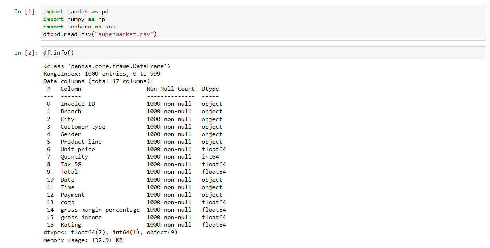

## BOXPLOT METHOD TO ANALYZE OUTLIERS:
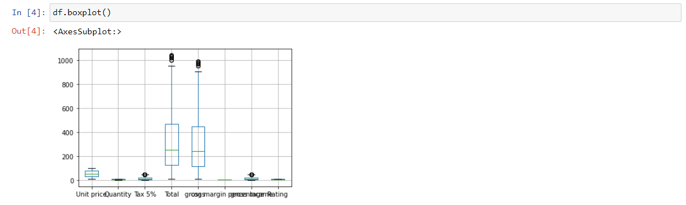

## REMOVING OUTLIERS USING IQR METHOD:
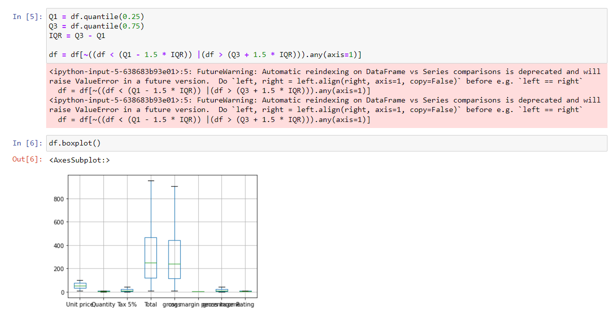

## COUNTPLOT METHOD FOR DATA ANALYSIS:
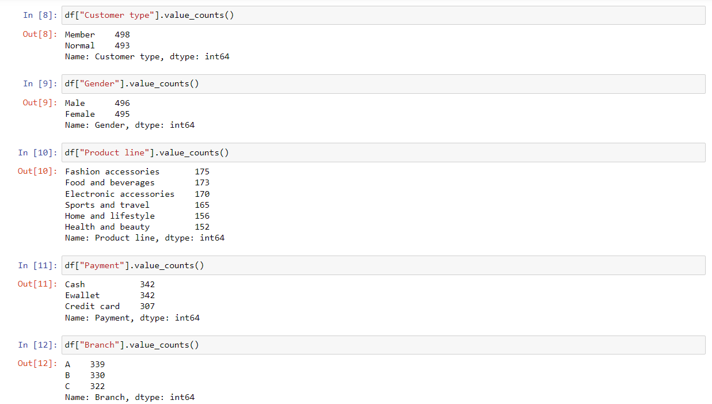
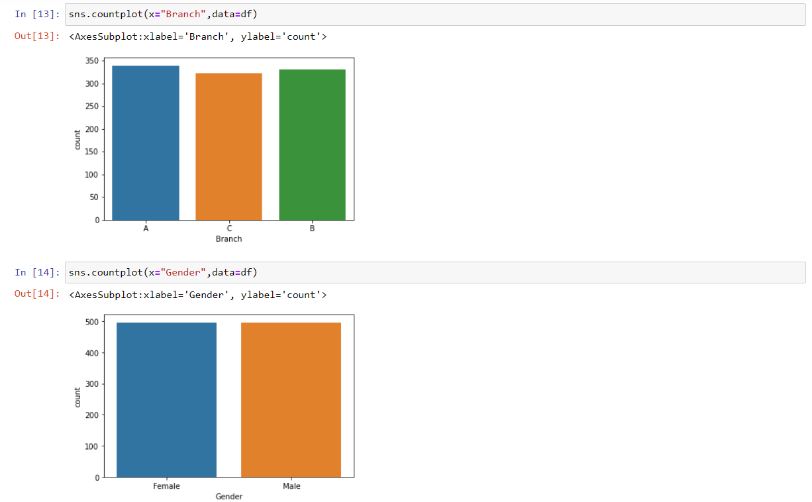
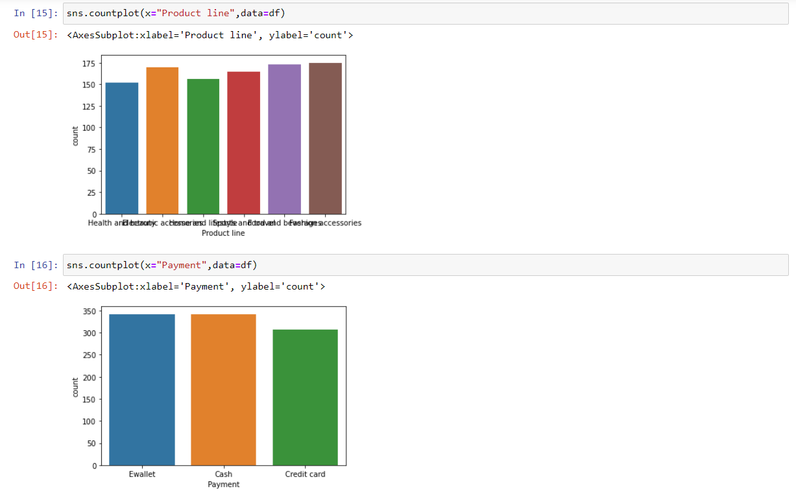

## DISPLOT METHOD FOR DATA ANALYSIS:
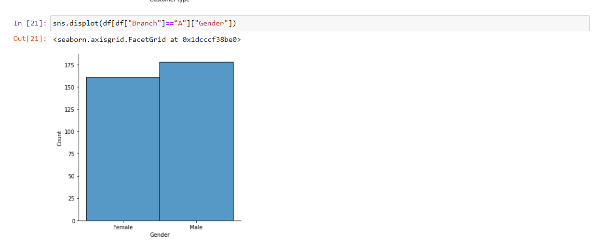
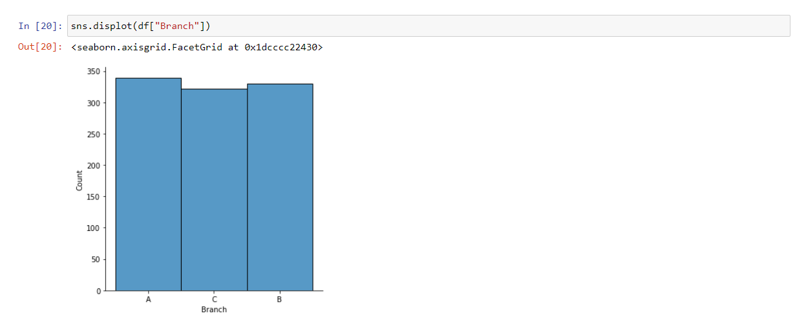
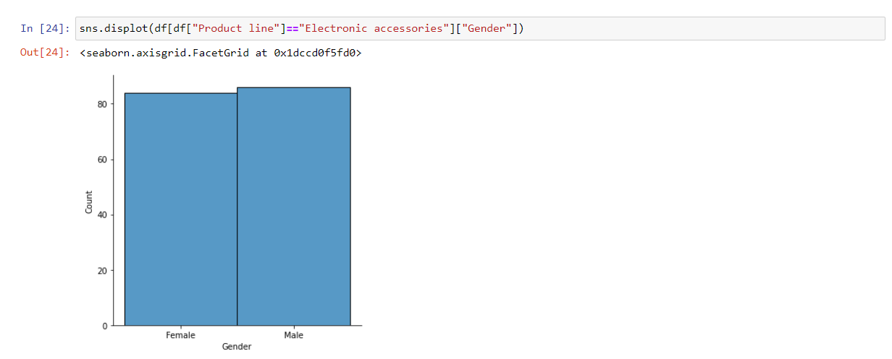
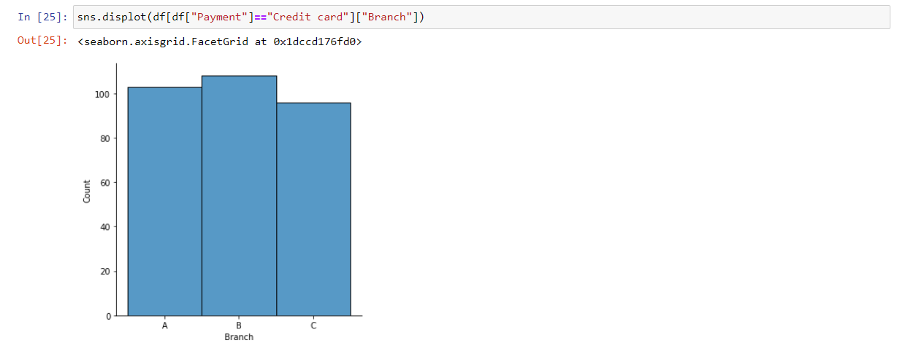

## COUNTPLOT METHOD TO COMPARE TWO ENTITIES:
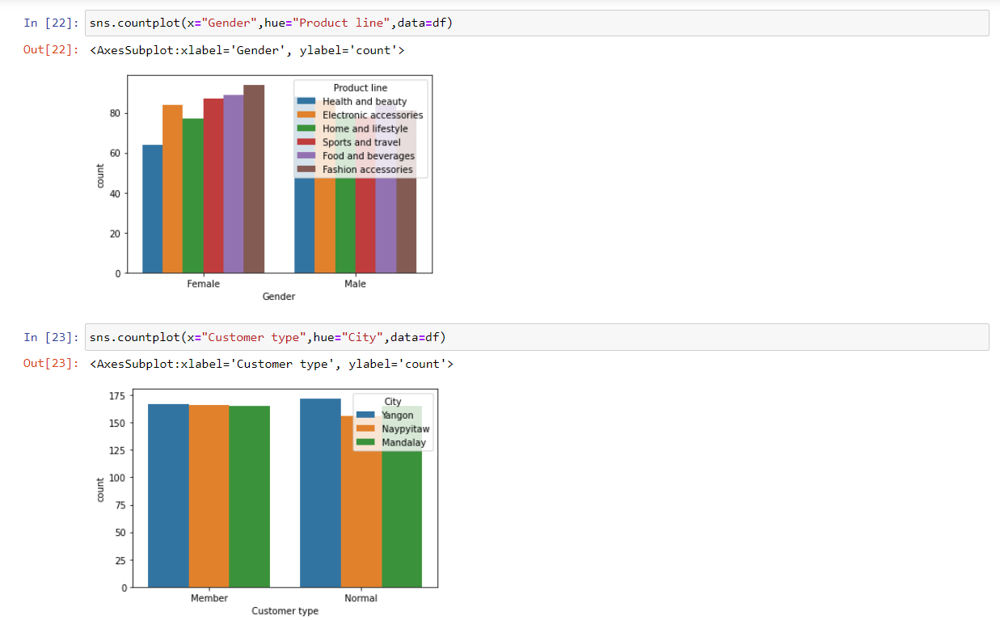

## CROSS TABULATION FOR DATA ANALYSIS:
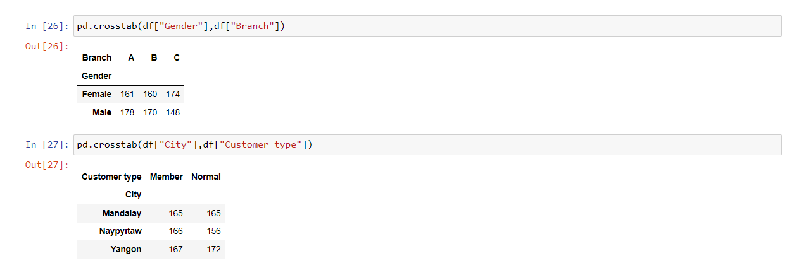

## CORRELATION METHOD:
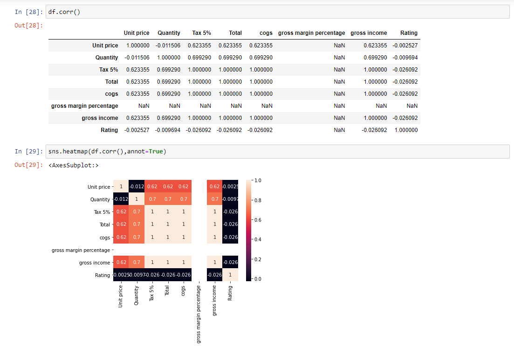

# Result:
Hence the given data set has undergone data cleansing and outlier removal.Later Exploratory data analysis is done to get inferences from the given data set.